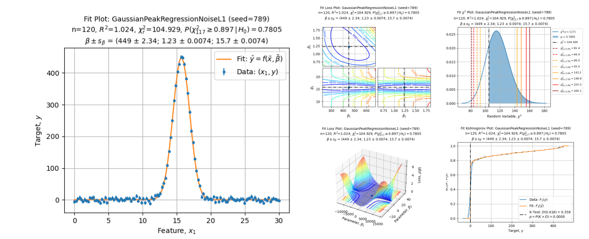
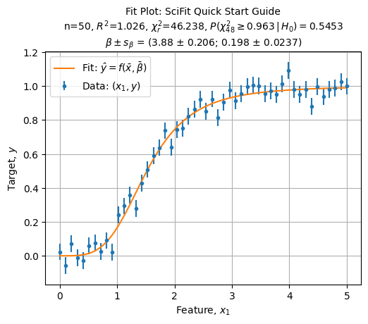

[](https://github.com/jlandercy/scifit/actions/workflows/pypi.yaml)
[](https://github.com/jlandercy/scifit/actions/workflows/docs.yaml)



# SciFit

> Comprehensive fits for scientists

Welcome to SciFit package the python package for comprehensive fits for scientists
designed to ease fitting procedure and automatically perform the quality assessment.

SciFit aims to support your work by:

 - Providing a clean, stable and compliant interface for each solver;
 - Perform ad hoc transformations, processing and tests on each stage of solver procedure;
 - Render high quality figures summarizing solver solution and quality assessments.

## Installation

You can install the SciFit package by issuing:

```commandline
python -m pip install --upgrade scifit
```

## Quick start

Let's fit some data:

```python
from scifit.solvers.scientific import *

# Select a specific solver:
solver = HillEquationFitSolver()

# Create some synthetic dataset:
data = solver.synthetic_dataset(
    xmin=0.0, xmax=5.0, dimension=1, resolution=50,
    parameters=[3.75, 0.21],
    sigma=0.1, scale_mode="auto", seed=1234,
)

# Stor data into the solver:
solver.store(data=data)

# Perform regression:
solution = solver.fit()

# Render results:
axe = solver.plot_fit(title="SciFit Quick Start Guide")
```


