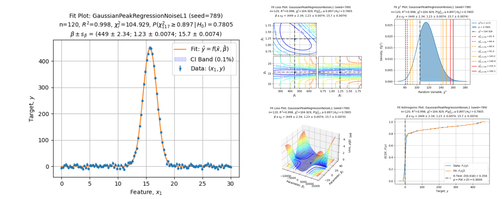

[](https://github.com/jlandercy/scifit/actions/workflows/pypi.yaml)
[](https://github.com/jlandercy/scifit/actions/workflows/docs.yaml)



# SciFit

> Comprehensive fits for scientists

Welcome to SciFit project the Python package for comprehensive fits for scientists
designed to ease fitting procedure and automatically perform the quality assessment.

The SciFit project aims to support your work by:

 - Providing a clean, stable and compliant interface for each solver;
 - Perform ad hoc transformations, processing and tests on each stage of a solver procedure;
 - Render high quality figures summarizing solver solution and the quality assessment.

## Installation

You can install the SciFit package by issuing:

```commandline
python -m pip install --upgrade scifit
```

Which update you to the latest version of the package.

## Quick start

Let's fit some data:

```python
from scifit.solvers.scientific import *

# Select a specific solver:
solver = GaussianPeakFitSolver()

# Create some synthetic dataset:
data = solver.synthetic_dataset(
    xmin=0.0, xmax=30.0, resolution=120,
    parameters=[450.3, 1.23, 15.7],
    sigma=2.5e-2, scale_mode="auto", seed=12345,
)

# Perform regression:
solution = solver.fit(data, p0=(500, 5, 20))

# Render results:
axe = solver.plot_fit()
```

Which return the following adjustment:


And the following Goodness of Fit test:

```python
# Render Chi Square Test:
axe = solver.plot_chi_square()
```


## Resources

 - [Documentations][20]
 - [Repository][21]

[20]: https://github.com/jlandercy/scifit/tree/main/docs
[21]: https://github.com/jlandercy/scifit