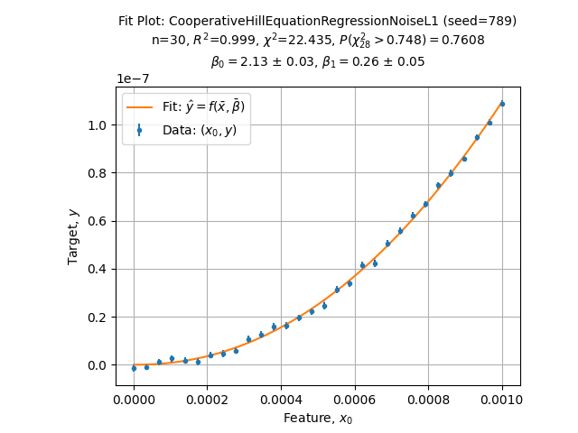
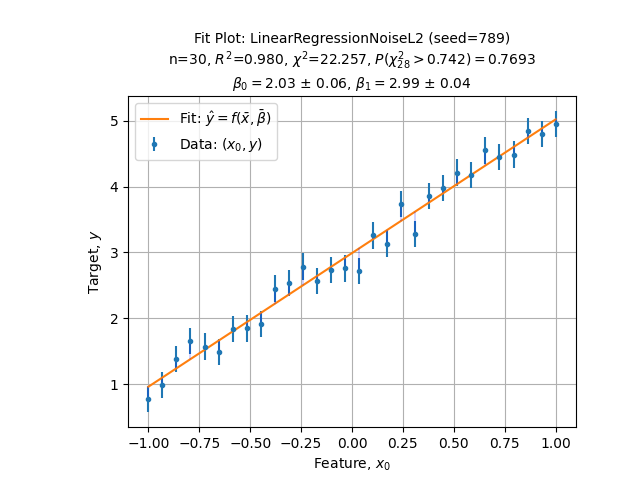

Quick Start Guide
=================

Fit an existing Model
---------------------

Let's say we have experimental data suspected to follow the Hill Equation:

.. math::

    \theta = \frac{k \cdot L^n}{1 + k \cdot L^n}

Fitting data is then as simple as:

.. code-block:: python

    from scifit.solvers.scientific import HillKinetic

    solver = HillKinetic()
    solution = solver.fit(X, y, sigma=sigma)

    solver.plot_fit()

And it renders as follow:

Where detailed solution is:

.. code-block:: json

    {
        "parameters": [2.1273207 , 0.26342174],
        "covariance": [
            [3.83758686e+14, 7.15865440e+14],
            [7.15865440e+14, 1.33634099e+15]
        ]
    }

Create a new model
------------------

To create a new model, first import the Solver interface:

.. code-block:: python

    from scifit.interfaces.generic import FitSolverInterface

Then create the model function by overriding the model method:

.. code-block:: python

    class LinearFitSolver(FitSolverInterface):
        @staticmethod
        def model(x, a, b):
            return a * x[:, 0] + b

We simply chose the classical linear regression for simplicity sake.
At this point everything is setup, it is just about fit the data.

Create an new instance of the solver:

.. code-block:: python

    solver = LinearFitSolver()

Fit the model to experimental data:

.. code-block:: python

    solution = solver.fit(X, y, sigma=sigma)

It returns a complete solution set and exposes convenience
to analyse the regression in depth:

.. code-block:: python

    solver.plot_fit()
    solver.plot_loss()

Rendering respectively the fitted model to the data and the loss function
wrt parameters:

.. image:: ../media/figures/QuickStart_LinearLoss.png
  :width: 560
  :alt: Classical Linear Regression (loss)
